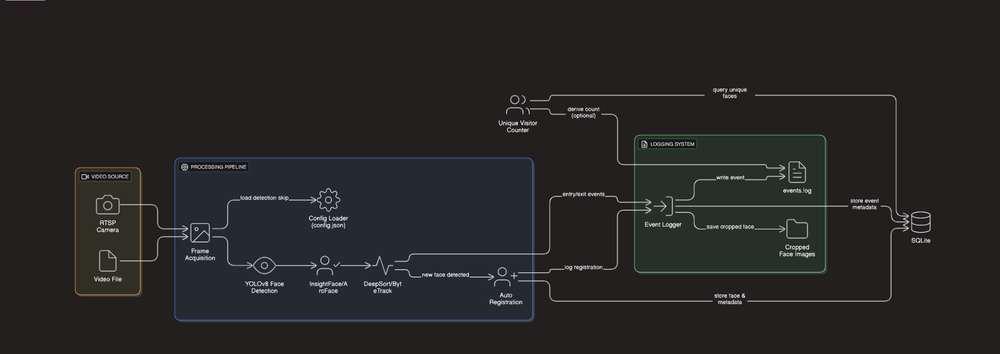

# 🧠 Intelligent Face Tracking System

A real-time intelligent face recognition and tracking system using **YOLOv8**, **InsightFace**, **SQLite**, and **Flask**.  
Built for a hackathon organized by [Katomaran](https://katomaran.com).

---

## 🎥 Loom Video Demo

▶️ Watch here: [Loom Video Walkthrough](https://www.loom.com/share/631734a8f4954e29ae269a350b007d66)

---

## 📦 Features

- Real-time face detection, recognition, and tracking via video input
- Face entry & exit logging with:
  - Timestamp
  - Cropped face image
  - Event type (entry/exit)
  - Face ID
- Local folder structure for face images
- SQLite DB for all events
- `events.log` for audit trail
- Unique visitor count tracking
- Minimal Flask dashboard UI with animated view

---

## 🏗️ Architecture

[](architecture_diagram.png)

---

## ⚙️ Setup Instructions

1. **Clone this repository**  
   ```bash
   git clone https://github.com/your-username/intelligent-face-tracker.git
   cd intelligent-face-tracker
````

2. **Create and activate virtual environment**

   ```bash
   python -m venv venv
   venv\Scripts\activate
   ```

3. **Install dependencies**

   ```bash
   pip install -r requirements.txt
   ```

4. **Place your video**
   Save your input video (e.g., `input.mp4`) in the project root.

5. **Run video tracker**

   ```bash
   python src/video_tracker.py
   ```

6. **Launch Flask dashboard**

   ```bash
   python src/app.py
   ```

---

## ⚙️ Assumptions

* Each unique face is assigned a new ID based on embedding similarity
* A face is marked as "exit" if not seen for 15 consecutive frames
* No face recognition on side profiles
* Videos are processed sequentially
* Webcam input is supported (by changing `VideoCapture(0)`)

---

## 🔧 Sample `config.json` (Optional Enhancement)

```json
{
  "video_path": "input.mp4",
  "similarity_threshold": 0.6,
  "exit_frame_threshold": 15
}
```
## 🗃️ Folder Structure

```
intelligent-face-tracker/
│
├── logs/
│   ├── entries/
│   ├── events.log
│   └── face_data.db
│
├── src/
│   ├── video_tracker.py
│   ├── database.py
│   ├── app.py
│   └── ...
│
├── templates/
│   └── index.html
│
├── input.mp4
├── requirements.txt
├── README.md
└── ...
```

---

## ✅ Sample Outputs

* Face logs: `logs/events.log`
* Cropped face images: `logs/entries/YYYY-MM-DD/`
* SQLite table: `logs/face_data.db`

---

## 📈 Unique Visitor Count

You can run:

```bash
python src/unique_count.py
```

To get total number of unique visitors detected across sessions.

---

## 🏁 Final Notes

This project is part of a hackathon run by [https://katomaran.com](https://katomaran.com)

---

